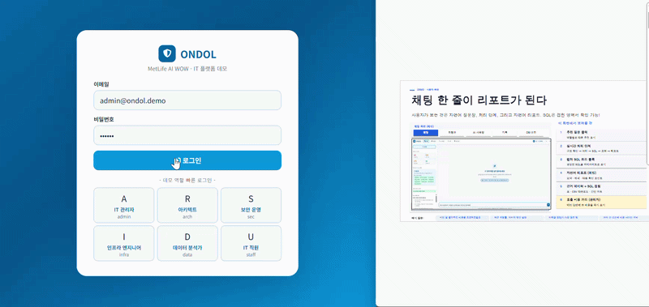

# ONDOL - AI 기반 IT 운영 플랫폼
## AI WOW Competition · Team ONDOL · 온돌

> 온돌처럼 IT 운영의 모든 영역을 따뜻하게 연결하는 멀티 에이전트 AI 플랫폼입니다.

**한국어 | [English](README.md)**



[YouTube에서 전체 데모 보기](https://youtu.be/qUHExHGmuqs)

### 상세 문서

- [문서 홈](docs/Home.md)
- [아키텍처](docs/Architecture.md)
- [에이전트와 파이프라인](docs/Agents.md)
- [보안 및 컴플라이언스](docs/Security.md)
- [데이터 및 연동 방향](docs/Data-and-Integration.md)
- [API 및 운영](docs/API-and-Operations.md)

---

## ONDOL이란?

ONDOL은 IT 운영 데이터를 자연어로 조회하고, 전문 에이전트가 업무별 결과를 만들어 주는 Flask 기반 Agentic AI 데모입니다.

- 데이터베이스 스키마와 실제 샘플을 확인한 뒤 자연어 질문을 SQL로 변환
- Supervisor가 질문을 분석하고 적절한 전문 에이전트를 선택
- Schema Discovery, Semantic Layer, Text-to-SQL, Evaluator가 단계별로 협력
- 결과를 별도의 Evaluator가 0~100점으로 검증하고 필요하면 재시도
- SSE로 에이전트의 처리 단계를 실시간 스트리밍
- RBAC, PII 마스킹, 입력·출력 콘텐츠 필터, 감사 로그 제공
- IT 비용, 인시던트, 보안 알림, 접근 요청을 위한 BI 화면 제공

## 역할별 주요 기능

| 역할 | 주요 기능 |
| --- | --- |
| IT Admin | 전체 데이터, 비용 대시보드, 감사 로그, 모든 에이전트 |
| Architect | ARB 문서 작성, 기술 표준 확인, 데이터 조회 |
| Security Ops | 보안 알림 분류, 접근 요청, 보안 데이터 조회 |
| Infra Engineer | 인프라 운영, VM 비용 및 용량 분석 |
| Data Analyst | KPI, 추세, SLA 분석 (PII 마스킹) |
| IT Staff | 기본 인시던트 및 ARB 상태 조회 |

## 빠른 시작

```powershell
# 1. 가상환경 생성 및 활성화
python -m venv .venv
.\.venv\Scripts\Activate.ps1

# 2. 의존성 설치
python -m pip install -r requirements.txt

# 3. 로컬 설정 생성 (.env는 커밋하지 않음)
copy .env.example .env
# .env에 OPENAI_API_KEY와 고유한 SECRET_KEY 입력

# 4. 데모용 SQLite DB 생성
python data/seed.py

# 5. 실행
python app.py
# http://localhost:5001
```

API 키가 없으면 일부 에이전트는 데모 응답을 사용합니다. 데모 계정과 데이터는 모두 합성 데이터이며, 운영 환경에서 기본 계정을 그대로 사용하지 마세요.

## 데모 계정

| 이메일 | 비밀번호 | 역할 |
| --- | --- | --- |
| admin@ondol.demo | admin1 | IT Admin |
| arch@ondol.demo | arch1 | Architect |
| sec@ondol.demo | sec1 | Security Ops |
| infra@ondol.demo | infra1 | Infra Engineer |
| data@ondol.demo | data1 | Data Analyst |
| staff@ondol.demo | staff1 | IT Staff |

## 아키텍처

```text
사용자 브라우저
     |
     v
Flask API (app.py)
     |
     v
보안 게이트: PII / RBAC / 콘텐츠 필터 / 감사 로그
     |
     v
Supervisor -> Schema Discovery -> Semantic Layer
     |                                  |
     +--> 전문 에이전트 -----------------+
                |
                v
        Evaluator -> 결과 또는 재시도
```

### 기술 구성

| 영역 | 기술 |
| --- | --- |
| Web | Flask, Vanilla JavaScript, Chart.js |
| AI | OpenAI GPT-4o, GPT-4o-mini |
| 오케스트레이션 | LangGraph 패턴의 표준 라이브러리 구현 |
| 데이터베이스 | 로컬 데모용 SQLite |
| 설정 | YAML, 환경변수 |
| 스트리밍 | Server-Sent Events (SSE) |

## Agentic AI 핵심 개념

일반적인 AI는 `사용자 → 단일 LLM 호출 → 응답`으로 동작합니다. ONDOL은 `사용자 → 오케스트레이터 → 전문 에이전트 → 자체 평가 → 필요 시 재시도 → 응답`의 흐름을 사용합니다.

### 1. 자율적 라우팅

Supervisor는 질문의 의도와 사용자 역할을 확인해 필요한 에이전트를 선택합니다. 예를 들어 비용 조회와 ARB 문서 작성이 함께 요청되면 여러 단계가 필요한 작업으로 판단합니다.

### 2. 명시적 계획

실행 전에 단계, 의존성, 복잡도를 포함한 실행 계획을 만듭니다. 각 에이전트가 담당하는 일이 분리되어 있어 처리 과정과 실패 지점을 확인하기 쉽습니다.

### 3. 도구 사용

에이전트는 SQL 실행과 검증, 캐시, 스키마 조회 같은 도구를 호출합니다. 운영 환경에서는 ServiceNow 티켓 생성, AD 그룹 조회, Splunk API 호출 등으로 확장할 수 있습니다.

### 4. 자체 평가와 재시도

Evaluator가 생성 결과를 독립적으로 평가합니다. 점수가 기준값보다 낮으면 더 강력한 모델로 재시도해 사용자 개입 없이 품질을 보완합니다.

### 5. 상태와 대화 맥락

`AgentState`가 질문, 역할, 계획, 스키마, 결과, 평가 정보를 노드 사이에 전달합니다. 이를 통해 이전 질문의 조건을 활용한 후속 질문을 지원합니다.

### 6. 투명성

SSE를 통해 Supervisor의 계획, 스키마 탐색, SQL 생성, 평가 결과를 실시간으로 화면에 전달합니다.

### 멀티 에이전트 구조를 사용하는 이유

하나의 LLM에 라우팅, 도메인 지식, SQL 생성, 품질 검사를 모두 맡기면 책임이 섞이고 검증이 독립적이지 않습니다. ONDOL은 저비용 모델을 라우팅과 일반 작업에 사용하고, 복잡한 계획이나 재시도에만 더 강력한 모델을 사용하도록 분리합니다.

## 멀티 에이전트 파이프라인

```text
사용자 질문
          |
          v
보안 게이트
     1. 입력 PII 제거
     2. 역할과 권한 확인
     3. 프롬프트 인젝션 및 콘텐츠 필터
     4. 대화 로그 기록
          |
          v
Supervisor (GPT-4o)
     실행 계획과 에이전트 선택
          |
          +--> Schema Discovery (GPT-4o-mini)
          |      실제 테이블, 컬럼, 샘플 값 탐색
          |
          +--> Semantic Layer (LLM 없음)
          |      용어, KPI, 표준 JOIN 경로 연결
          |
          +--> 전문 에이전트 (GPT-4o-mini)
                          SQL / ARB / 접근 권한 / 인프라 / 보안
                                                  |
                                                  v
                               Evaluator (GPT-4o-mini)
                                   통과 또는 모델 업그레이드 재시도
```

## 에이전트별 역할

### Supervisor

질문을 분석하고 실행 계획을 JSON으로 만듭니다. 역할별 접근 가능 에이전트와 질문의 복잡도를 고려해 다음 단계를 결정합니다.

### Schema Discovery

허용된 테이블의 DDL, 컬럼 정보, 행 수, 대표 샘플을 읽습니다. 질문과 관련된 데이터 프로파일을 만들어 SQL 에이전트가 존재하지 않는 컬럼을 추측하지 않도록 합니다.

### Semantic Layer

`MTTD`, `MTTR`, SLA, right-sizing 같은 업무 용어를 실제 컬럼과 계산식에 연결합니다. 결정론적으로 동작하므로 불필요한 LLM 호출과 비용을 줄이고, 역할에 따라 접근 가능한 테이블만 사용합니다.

### Text-to-SQL

자연어 질문을 SQLite SQL로 변환하고 읽기 전용 검증을 수행합니다. 결과에는 SQL, 설명, 데이터, 인사이트가 포함되며 PII 마스킹은 역할에 따라 적용됩니다.

### Architecture Review

ARB/RFC 초안을 만들고 기술 구조, 위험 평가, 컴플라이언스 체크리스트, 다음 단계를 정리합니다.

### Access Request

AD 그룹과 권한 요청을 분석하고 Read/Write/Admin 수준 및 Low/Medium/High 위험도를 분류합니다. 낮은 위험 요청은 자동 승인 후보로, 높은 위험 요청은 추가 승인이 필요한 요청으로 표시합니다.

### Infrastructure Operations

VM right-sizing 후보, 클라우드 비용, 운영 런북, DR 절차를 분석합니다. 절감 예상액과 롤백 단계를 포함한 실행 가능한 결과를 생성합니다.

### Security Triage

보안 알림을 P1-P4로 분류하고 MITRE ATT&CK 매핑, SOAR 플레이북, Splunk SPL, 즉시 대응 순서를 제안합니다.

### Evaluator

SQL 정확성, 완전성, 환각 여부, 안전성을 기준으로 0~100점 결과를 만듭니다. 설정된 통과 점수보다 낮으면 재시도 경로를 실행합니다.

## LangGraph 패턴 구현

현재 `pipeline/graph.py`는 외부 LangGraph 의존성 없이 StateGraph와 유사한 실행 패턴을 구현합니다.

```python
state = {
          "question": question,
          "role": role,
          "plan": plan,
          "schema_context": schema_context,
}

result = graph.run(state)
```

운영 전환 시 다음과 같은 방향을 사용할 수 있습니다.

```python
from langgraph.graph import END, StateGraph

workflow = StateGraph(AgentState)
workflow.add_node("supervisor", supervisor_node)
workflow.add_node("specialist", specialist_node)
workflow.add_node("evaluator", evaluator_node)
workflow.set_entry_point("supervisor")
workflow.add_edge("supervisor", "specialist")
workflow.add_edge("specialist", "evaluator")
workflow.add_edge("evaluator", END)
graph = workflow.compile()
```

실제 운영에서는 SQLite checkpointer 대신 PostgreSQL 기반 persistence, P1 작업의 human-in-the-loop 승인, tracing과 배포별 agent registry를 추가하는 것이 좋습니다.

## YAML 파이프라인 설정

`pipeline/config.yaml`이 모델, 토큰 한도, temperature, 재시도 횟수, 평가 통과 점수, 에이전트별 프롬프트, RBAC를 관리합니다.

```yaml
models:
     supervisor: gpt-4o
     specialist: gpt-4o-mini
     evaluator: gpt-4o-mini
     retry_upgrade: gpt-4o

pipeline:
     max_retries: 1
     eval_pass_threshold: 70
```

프롬프트는 `pipeline/prompts/` 아래 Markdown 파일로 분리되어 있어 코드 배포 없이 검토와 수정이 가능합니다.

## Semantic Layer

Semantic Layer는 데이터베이스의 물리적 구조와 사용자가 쓰는 업무 언어 사이를 연결합니다.

- 용어 사전: `open incidents`, `right-sizing`, `SLA breach` 등의 표현을 컬럼과 조건으로 매핑
- KPI 정의: MTTD, MTTR, 승인율, 비용 등 표준 계산식 제공
- JOIN 경로: incidents, departments, employees 등 테이블 사이의 안전한 연결 경로 제공
- 역할 필터: RBAC가 허용한 테이블과 컬럼만 컨텍스트에 포함
- 실시간 스키마: 데이터베이스 구조가 변경되면 현재 스키마를 다시 읽음

이 계층을 별도로 두면 에이전트 프롬프트를 수정하지 않고도 실제 데이터 소스가 바뀌어도 의미 체계를 유지할 수 있습니다.

## SSE 실시간 스트리밍

브라우저는 Server-Sent Events를 사용해 실행 중인 처리 단계를 받습니다. 일반적인 이벤트 순서는 다음과 같습니다.

```text
connected -> plan -> schema -> semantic -> agent -> evaluation -> complete
```

SSE는 서버에서 브라우저로 흐르는 단방향 스트림에 적합합니다. 사용자는 최종 답변을 기다리는 동안 현재 어느 단계가 실행 중인지 확인할 수 있습니다.

## RBAC 및 보안 게이트

보안 게이트는 AI 호출 전후에 적용됩니다.

| 단계 | 보호 기능 |
| --- | --- |
| 입력 | 이메일, 전화번호, 주민등록번호 등 PII 제거 |
| 권한 | 역할별 agent 및 table 접근 제한 |
| 콘텐츠 | 위험한 지시와 프롬프트 인젝션 필터 |
| SQL | SELECT 중심의 읽기 전용 검증과 행 수 제한 |
| 출력 | 권한이 없는 역할의 PII 마스킹 |
| 감사 | 로그인, 거부, 질문, 비용, 응답 이벤트 기록 |

데모에서 제공하는 역할은 예시용입니다. 운영 환경에서는 기존 IAM/SSO와 연계하고 비밀번호를 평문으로 저장하지 않는 인증 방식으로 교체해야 합니다.

## 비용 관리

모든 LLM 호출은 모델, 에이전트, prompt token, completion token, 예상 비용을 `api_cost_log`에 기록합니다.

- Supervisor와 retry는 복잡한 작업에만 사용
- Schema Discovery 결과와 SQL 결과를 캐시해 반복 호출 감소
- 전문 에이전트와 Evaluator는 저비용 모델 중심으로 실행
- IT Admin과 Infra Engineer는 비용 대시보드에서 모델별, 세션별, 최근 호출별 비용 확인
- `MAX_COST_PER_SESSION`으로 세션 비용 제한 설정 가능

실제 비용은 모델 가격 정책과 토큰 사용량에 따라 달라지므로 운영 전에 현재 가격표를 확인해야 합니다.

## BI 대시보드

웹 화면에서는 다음 운영 지표를 확인할 수 있습니다.

- 미해결 인시던트 및 P1 인시던트
- 보류 중인 접근 요청
- 미해결 보안 알림
- VM right-sizing 후보와 월간 인프라 비용
- 모델 및 에이전트별 API 비용
- 역할별 스키마 브라우저와 관리자 감사 로그

대시보드 데이터는 `data/seed.py`가 생성한 합성 SQLite 데이터에서 제공됩니다.

## 데이터베이스 스키마

데모 DB는 다음과 같은 13개 테이블로 구성됩니다.

| 그룹 | 테이블 |
| --- | --- |
| 조직 | `departments`, `employees` |
| 운영 | `incidents`, `change_log`, `infra_assets` |
| 접근 및 설계 | `access_requests`, `arb_reviews` |
| 보안 | `security_alerts` |
| 비용 및 KPI | `cost_forecast`, `kpi_snapshots`, `api_cost_log` |
| 감사 | `audit_log`, `conversation_log` |

`seed.py`는 동일한 random seed를 사용해 재현 가능한 데모 데이터를 만들며, 모든 사람 이름은 `SYN_` 접두사를 사용합니다. 생성된 DB 파일은 Git에서 제외됩니다.

## 데이터 소스 방향

`data/seed.py`는 로컬 데모와 CI를 위한 일회성 합성 데이터 생성기입니다. 반복 가능한 데모를 위해 샘플 레코드와 확률값이 코드에 포함되어 있으며, 실제 운영 정책이나 실데이터를 의미하지 않습니다.

운영 환경에서는 다음 방향으로 교체하는 것을 권장합니다.

- 운영 데이터: Azure SQL 또는 PostgreSQL adapter
- 분석 데이터: Databricks SQL Warehouse adapter
- 인증: Managed Identity 또는 환경변수 기반 자격 증명
- 공통화: 현재 Semantic Layer 인터페이스를 유지하고 배포 설정으로 데이터 소스 선택
- 마이그레이션: schema migration과 connection pool을 사용하고 `seed.py`를 운영 환경에서 호출하지 않음

## 보안 및 공개 저장소 주의사항

- `.env`, SQLite DB, 로그, Python 캐시 파일은 Git에서 제외됩니다.
- API 키와 운영 비밀값을 소스 코드나 README에 작성하지 마세요.
- 운영 환경에서는 `DEBUG=false`와 강력한 `SECRET_KEY`를 사용하세요.
- 데모 계정은 공개 예시용이므로 운영 배포 전에 인증 방식을 교체하세요.
- 과거에 실제 API 키를 `.env`에 넣었다면 저장소 공개 전에 키를 폐기하고 새로 발급하세요.

## 주요 엔드포인트

- `GET /` - 웹 애플리케이션
- `POST /api/login` - 로그인
- `POST /api/logout` - 로그아웃
- `POST /api/ask` - 질문 실행
- `GET /api/stats` - 대시보드 지표
- `GET /api/schema` - 역할별 접근 가능 스키마
- `GET /api/cost` - 비용 대시보드 (권한 필요)
- `GET /api/audit` - 감사 로그 (관리자 권한 필요)

## 프로젝트 구조

```text
ondol/
├── app.py                 # Flask 애플리케이션과 API 라우트
├── config.py              # 환경변수 기반 설정
├── agents/                # Supervisor, 전문 에이전트, Evaluator
├── core/                  # RBAC, PII 필터, Semantic Layer
├── data/seed.py           # 로컬 데모용 합성 DB 생성기
├── pipeline/              # 그래프, 노드, YAML 설정, 프롬프트
├── templates/index.html   # 웹 SPA
├── demo/                  # GIF 및 영상 데모
└── requirements.txt       # Python 의존성
```

영문 README와 동일한 수준으로 핵심 에이전트 동작, LangGraph 전환 예시, 비용 모델, 보안 게이트, 전체 스키마를 이 문서에 정리했습니다. 영문 원문과 코드 예시는 [영문 README](README.md)에서도 확인할 수 있습니다.

---

*ONDOL의 모든 데이터베이스 레코드는 합성 데이터입니다.*
